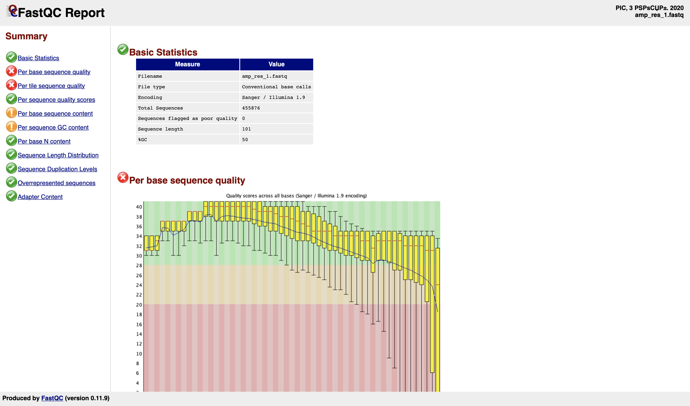
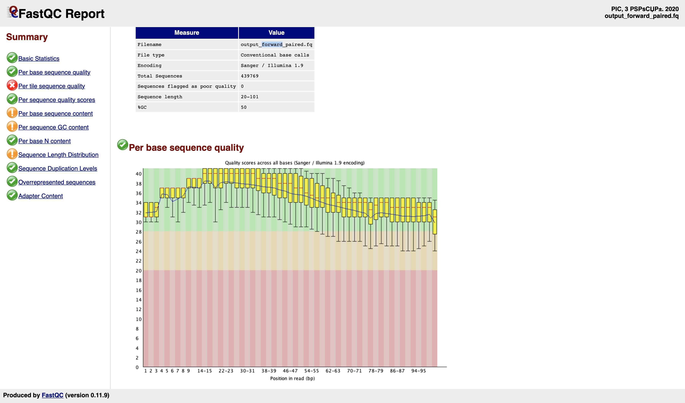
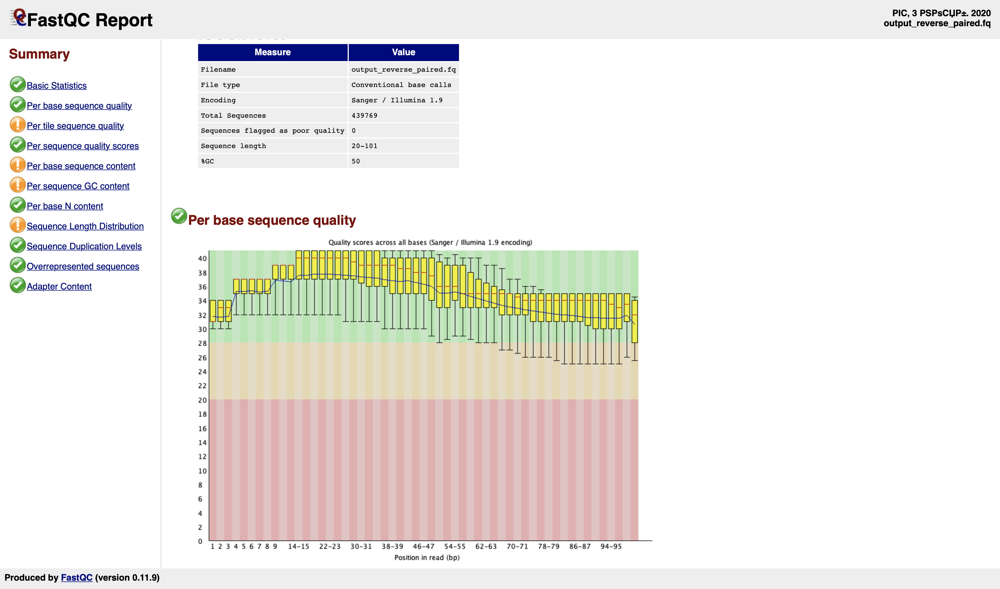
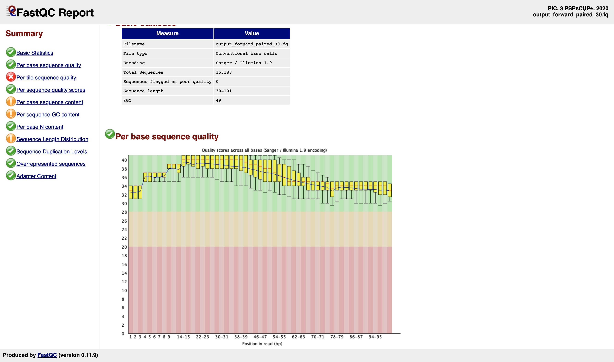
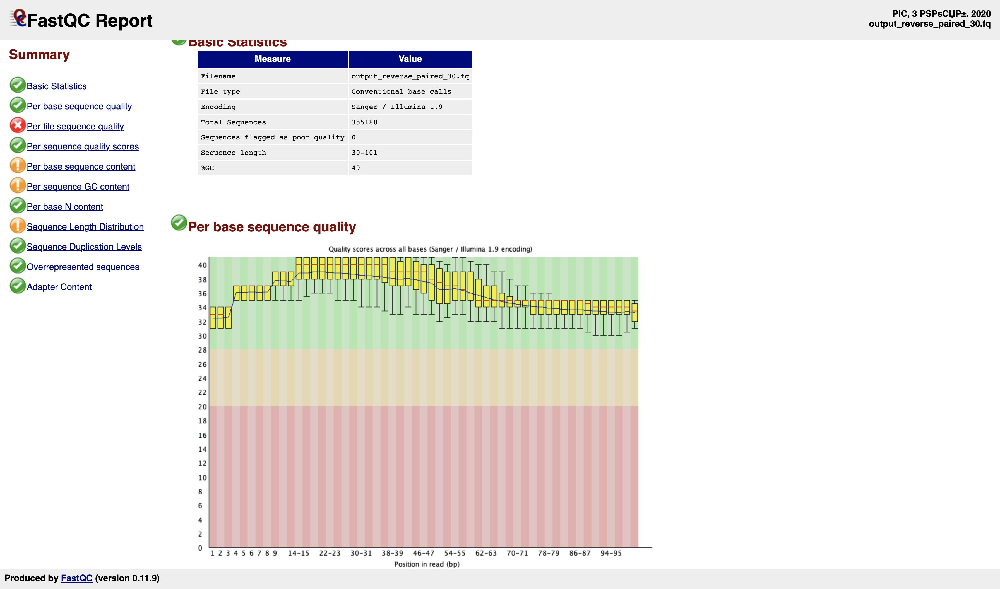

# Project #1. “What causes antibiotic resistance?”

**Day 1. 30.10.2020**

## 1. Data

### 1.1. Data downloading

Sequence data

`wget ftp://ftp.ncbi.nlm.nih.gov/genomes/all/GCF/000/005/845/GCF_000005845.2_ASM584v2//GCF_000005845.2_ASM584v2_genomic.fna.gz`

Annotation data

`wget ftp://ftp.ncbi.nlm.nih.gov/genomes/all/GCF/000/005/845/GCF_000005845.2_ASM584v2//GCF_000005845.2_ASM584v2_genomic.gff.gz`

Sequencing of an E. coli strain that is resistant to the antibiotic ampicillin

Forward

`wget http://public.dobzhanskycenter.ru/mrayko/amp_res_1.fastq.zip`

Reverse

`wget http://public.dobzhanskycenter.ru/mrayko/amp_res_2.fastq.zip`

### 1.2. Data unzip

`gzip -d GCF_000005845.2_ASM584v2_genomic.fna.gz`

`gzip -d GCF_000005845.2_ASM584v2_genomic.gff.gz`

`unzip amp_res_1.fastq.zip`

`unzip amp_res_2.fastq.zip`

## 2. Inspect raw sequencing data manually

Inspect sequence file 1 (forward)

`head -20 amp_res_1.fastq`

Output:

```
@SRR1363257.37 GWZHISEQ01:153:C1W31ACXX:5:1101:14027:2198 length=101
GGTTGCAGATTCGCAGTGTCGCTGTTCCAGCGCATCACATCTTTGATGTTCACGCCGTGGCGTTTAGCAATGCTTGAAAGCGAATCGCCTTTGCCCACACG
+
@?:=:;DBFADH;CAECEE@@E:FFHGAE4?C?DE<BFGEC>?>FHE4BFFIIFHIBABEECA83;>>@>@CCCDC9@@CC08<@?@BB@9:CC#######
@SRR1363257.46 GWZHISEQ01:153:C1W31ACXX:5:1101:19721:2155 length=101
GTATGAGGTTTTGCTGCATTCTCTGNGCGAATATTAACTCCNTNNNNNTTATAGTTCAAAGCAAGTACCTGTCTCTTATACACATCTCCGAGCCCACGAGC
+
@@<?=D?D==?<AFGDF+AIHEACH#22<:?E8??:9??GG#0#####000;CF=C)4.==CA@@@)=7?C7?E37;3@>;;(.;>AB#############
@SRR1363257.77 GWZHISEQ01:153:C1W31ACXX:5:1101:5069:2307 length=101
GCTTCTCTTAACTGAGGTCACCATCATGCCGTTAAGTCCCTACCTCTCTTTTGCCGGTAACTGTTCCGCCGCGATTGCCTTTTATCTGTCTCTTATACACC
+
??<DBD;4C2=<BB>:AC;<CF<CE@FE9@E1C@891CD*9:?:3D@DD4?D<DD:0;@A=AEIDDA##################################
@SRR1363257.78 GWZHISEQ01:153:C1W31ACXX:5:1101:5178:2440 length=101
GCATAAGGACGATCGCTCCAGAGTAAAATAAATACGCGCATGTGATACTCACAATACCAATGGTGAAGTTACGGGACTTAAACAAACTGAGATCAAGAATC
+
CCCFFFFFHHHHHJJJJJJJJJJFFHIJJJJJJJJJJJJJJJJJJJJJJJIJHHHHHHFDEDF;AEEEEEEDDDDDBBACDDDCDDDDCCDDDDDDCCDC3
@SRR1363257.96 GWZHISEQ01:153:C1W31ACXX:5:1101:6707:2460 length=101
TCATTAAGCCGTGGTGGATGTGCCATAGCGCACCGCAAAGTTAAGAAACCGAATATTGGGTTTAGTCTTGTTTCATAATTGTTGCAATGAAACGCGGTGAA
+
CCCFFFFFHHHHHJHIIJIIIIJJJJJJGIJJJJJIJJIIGHJJJJJIIJJDHFFFFFEDACDDDCDDDDCCDDECACCDCCCDACDDDDCCDDDDDBD@A
```

Count reads in 1-st fastq file

`wc -l amp_res_1.fastq`

Output:

`1823504 amp_res_1.fastq`

Count reads in 2-nd fastq file

`wc -l amp_res_2.fastq`

Output:

`1823504 amp_res_2.fastq`

Thus, we have 1823504 / 4 = 455876 reads in each file

## 3. Inspect raw sequencing data with fastqc. Filtering the reads.

### 3.1. Install fastqc

`brew install fastqc`

### 3.2. Generate fastqc reports

Generate reports for both fastq files

`fastqc -o . amp_res_1.fastq amp_res_2.fastq`

As a result, two html reports was generated



Total Sequences in both files is 455876. It's correct result.

Now we will check data quality.

For `amp_res_1.fastq` reads we have 2 red circles (very unusual result):

* Per base sequence quality – this module raise a failure if the lower quartile for any base is less than 5 or if the median for any base is less than 20. We can perform quality trimming where reads are truncated based on their average quality to solve the problem.
* Per tile sequence quality – this module will issue a warning if any tile shows a mean Phred score more than 5 less than the mean for that base across all tiles.

For `amp_res_2.fastq` reads we have only 1 red circle (Per base sequence quality).

## 4. Filtering the reads

### 4.1. Quality score 20

Run Trimmomatic for filtering

`java -jar ../Trimmomatic-0.39/trimmomatic-0.39.jar PE -phred33 amp_res_1.fastq amp_res_2.fastq output_forward_paired.fq.gz output_forward_unpaired.fq.gz output_reverse_paired.fq.gz output_reverse_unpaired.fq.gz ILLUMINACLIP:../Trimmomatic-0.39/adapters/TruSeq3-PE.fa:2:30:10:2:keepBothReads LEADING:20 TRAILING:20 SLIDINGWINDOW:10:20 MINLEN:20`

Output:

```
TrimmomaticPE: Started with arguments:
 -phred33 amp_res_1.fastq amp_res_2.fastq output_forward_paired.fq.gz output_forward_unpaired.fq.gz output_reverse_paired.fq.gz output_reverse_unpaired.fq.gz ILLUMINACLIP:../Trimmomatic-0.39/adapters/TruSeq3-PE.fa:2:30:10:2:keepBothReads LEADING:20 TRAILING:20 SLIDINGWINDOW:10:20 MINLEN:20
Using PrefixPair: 'TACACTCTTTCCCTACACGACGCTCTTCCGATCT' and 'GTGACTGGAGTTCAGACGTGTGCTCTTCCGATCT'
ILLUMINACLIP: Using 1 prefix pairs, 0 forward/reverse sequences, 0 forward only sequences, 0 reverse only sequences
Input Read Pairs: 455876 Both Surviving: 439769 (96,47%) Forward Only Surviving: 15706 (3,45%) Reverse Only Surviving: 266 (0,06%) Dropped: 135 (0,03%)
TrimmomaticPE: Completed successfully
```

Now we will manually check the line count for each output file

`wc -l output_forward_paired.fq`

`1759076 output_forward_paired.fq`

1759076 / 4 = 439769 reads

`wc -l output_forward_unpaired.fq`

`62824 output_forward_unpaired.fq`

62824 / 4 = 15706

`wc -l output_reverse_unpaired.fq`

`1064 output_reverse_unpaired.fq`

1064 / 4 = 266

`wc -l output_reverse_paired.fq`

`1759076 output_reverse_paired.fq`

1759076 / 4 = 439769 reads

Now repeat fastqc analysis for trimmed data:

`fastqc -o . output_forward_paired.fq output_reverse_paired.fq`

Result for forward:



Result for reverse:



The quality of data increased, we don't have errors for Per base sequence quality any more.

### 4.2. Quality score 30

Now we will check the result for quality score 30.

`java -jar ../Trimmomatic-0.39/trimmomatic-0.39.jar PE -phred33 amp_res_1.fastq amp_res_2.fastq output_forward_paired_30.fq.gz output_forward_unpaired_30.fq.gz output_reverse_paired_30.fq.gz output_reverse_unpaired_30.fq.gz ILLUMINACLIP:../Trimmomatic-0.39/adapters/TruSeq3-PE.fa:2:30:10:2:keepBothReads LEADING:30 TRAILING:30 SLIDINGWINDOW:10:30 MINLEN:30`

Output:

```
TrimmomaticPE: Started with arguments:
 -phred33 amp_res_1.fastq amp_res_2.fastq output_forward_paired_30.fq.gz output_forward_unpaired_30.fq.gz output_reverse_paired_30.fq.gz output_reverse_unpaired_30.fq.gz ILLUMINACLIP:../Trimmomatic-0.39/adapters/TruSeq3-PE.fa:2:30:10:2:keepBothReads LEADING:30 TRAILING:30 SLIDINGWINDOW:10:30 MINLEN:30
Using PrefixPair: 'TACACTCTTTCCCTACACGACGCTCTTCCGATCT' and 'GTGACTGGAGTTCAGACGTGTGCTCTTCCGATCT'
ILLUMINACLIP: Using 1 prefix pairs, 0 forward/reverse sequences, 0 forward only sequences, 0 reverse only sequences
Input Read Pairs: 455876 Both Surviving: 355188 (77,91%) Forward Only Surviving: 41737 (9,16%) Reverse Only Surviving: 26816 (5,88%) Dropped: 32135 (7,05%)
TrimmomaticPE: Completed successfully
```

The result number of reads is 355188 (less than for 20 quality score).

Now repeat fastqc analysis for this data:

`fastqc -o . output_forward_paired_30.fq output_reverse_paired_30.fq`

Result for forward:



Result for reverse:



We can see that now we also have error for Per tile sequence quality in reverse reads, which didn't occurred before.