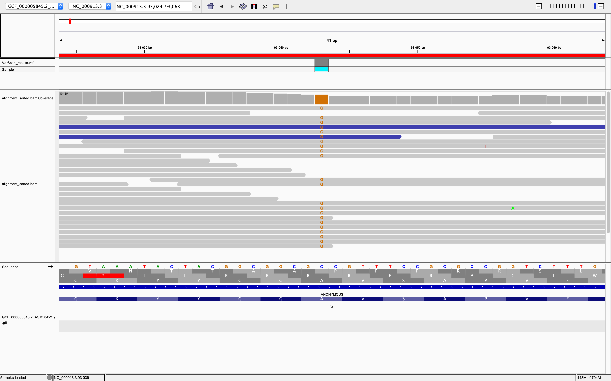
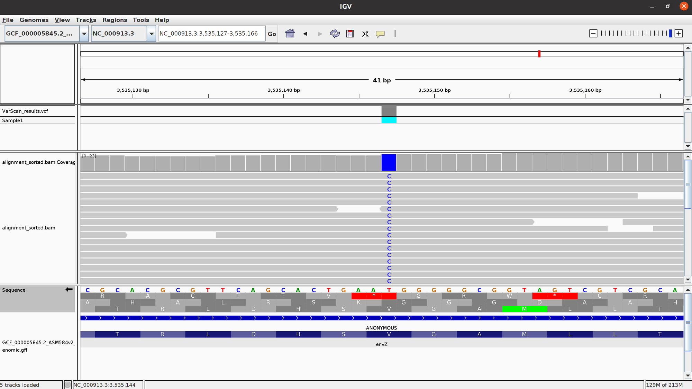

# Project #1. “What causes antibiotic resistance?”

**Day 2. 02.11.2020**

## 5. Aligning sequences to reference

Install aligner

`brew install bwa`

### 5.1. Index the reference file

`bwa index GCF_000005845.2_ASM584v2_genomic.fna`

### 5.2. Align reads

`bwa mem GCF_000005845.2_ASM584v2_genomic.fna output_forward_paired.fq output_reverse_paired.fq > alignment.sam`

### 5.3. Compress SAM file

Install samtools

`brew install samtools`

Compress SAM file

`samtools view -S -b alignment.sam > alignment.bam`

Basic statistics:

`samtools flagstat alignment.bam`

Output:

```
879796 + 0 in total (QC-passed reads + QC-failed reads)
0 + 0 secondary
258 + 0 supplementary
0 + 0 duplicates
878688 + 0 mapped (99.87% : N/A)
879538 + 0 paired in sequencing
439769 + 0 read1
439769 + 0 read2
875578 + 0 properly paired (99.55% : N/A)
877468 + 0 with itself and mate mapped
962 + 0 singletons (0.11% : N/A)
0 + 0 with mate mapped to a different chr
0 + 0 with mate mapped to a different chr (mapQ>=5)
```

99.87% of reads are mapped. It's good result.

### 5.4. Sort and index BAM file

1. Sort bam file by sequence coordinate on reference:
`samtools sort alignment.bam -o alignment_sorted.bam`

2. Index bam file for faster search:
`samtools index alignment_sorted.bam`

### 5.5. Visualize in IGV browser

In IGV browser result:


## 6. Variant calling

### 6.1. Create mpileup

`samtools mpileup -f GCF_000005845.2_ASM584v2_genomic.fna alignment_sorted.bam > my.mpileup`

### 6.2. Call VarScan

We use 0.8 for -min-var-frequency option

`java -jar ../VarScan.v2.4.4.jar  mpileup2snp my.mpileup --min-var-freq 0.8 --variants --output-vcf 1 > VarScan_results.vcf`

Result:

```
4641430 bases in pileup file
9 variant positions (6 SNP, 3 indel)
1 were failed by the strand-filter
5 variant positions reported (5 SNP, 0 indel)
```

## 7. Variant effect prediction

### 7.1. Mutations:

1.


2.


3.


4.


5.
